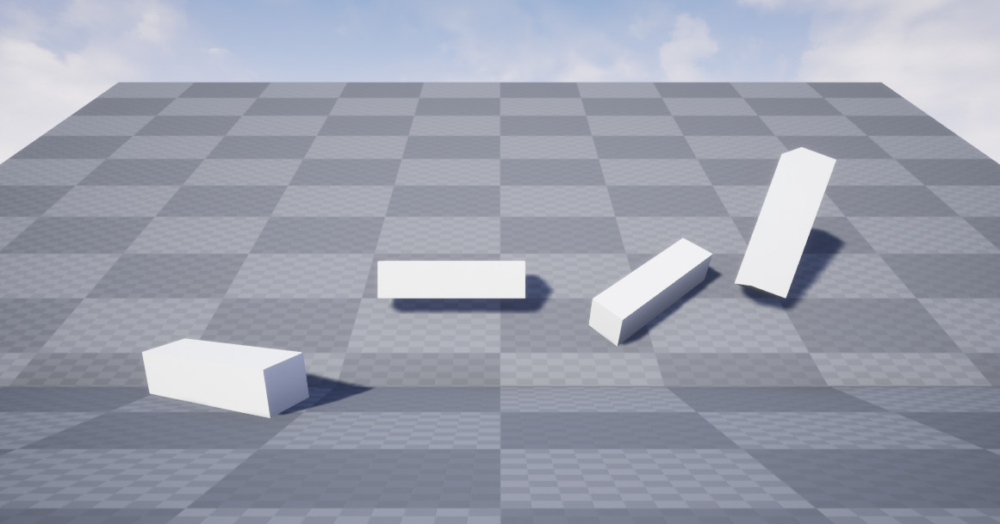

# Physics Constraints have no effect in Unreal 4.26

Summary: In Unreal 4.26.preview4 the physics *constraints* setting has no effect, while it is expected to behave like in 4.25.

Perhaps it is related to the [announced](https://forums.unrealengine.com/unreal-engine/announcements-and-releases/1814986-unreal-engine-4-26-preview) usage of "Chaos" engine instead of PhysX.

## Setup

The test scene contains 4 rigid-bodies falling onto a sloped plane.
They have the following constraint settings, from left to right:

* *None*
* *YZPlane*
* Lock X position
* PhysicsConstraintActor attached to this body, locking X movement and all rotations

The settings have been applied per-instance in the map.
The general intent of the constraints is to keep the body at X=0 and prevent it from sliding down the plane.

## Result in 4.25

We run this map in 4.25.3 and observe the constraints preventing the bodies from sliding down the plane.

## Result in 4.26

The same map run in 4.26.preview4 shows all bodies sliding the same way. The constraints have no effect.

